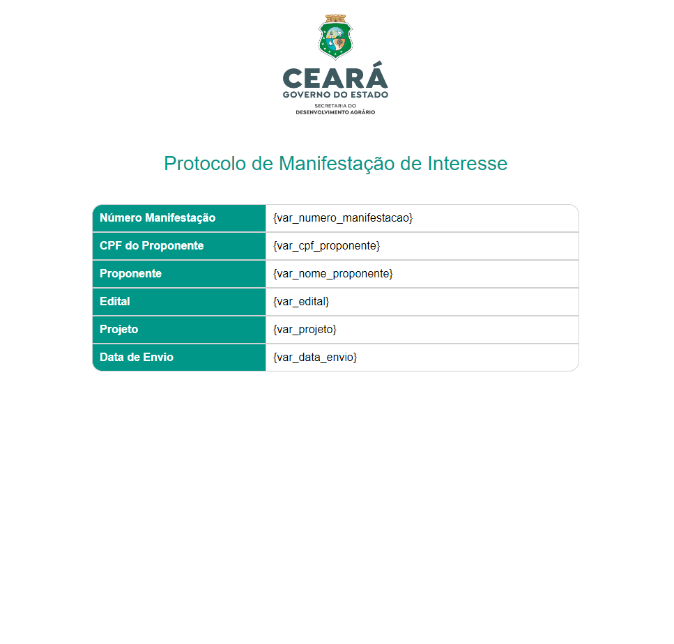

Criação de um protocolo em HTML CSS com chamada de variáveis em PHP para um sistema interno. 

Ps: Tiver que usar Métodos Inlines para aceitação adequada no framework que usamos no dia a dia. 

##
###

